# Diagrama de Actividad - Proceso de Programación EMO

## Descripción
Este diagrama muestra el flujo de actividades detallado para el proceso de programación de exámenes médicos ocupacionales en el sistema SOMA.

```mermaid
flowchart TD
    %% Inicio del proceso
    START([Inicio: Solicitud EMO]) --> INPUT[Ingresar datos del empleado]
    
    %% Validación de datos
    INPUT --> VALIDATE{Validar datos<br/>del empleado}
    VALIDATE -->|Datos inválidos| ERROR1[Mostrar errores de validación]
    ERROR1 --> INPUT
    VALIDATE -->|Datos válidos| CALCULATE[Calcular edad y determinar género]
    
    %% Envío a Capital Humano
    CALCULATE --> SEND_CH[Enviar solicitud a Capital Humano]
    SEND_CH --> WAIT_CH[Esperar validación de Capital Humano]
    
    %% Decisión de Capital Humano
    WAIT_CH --> DECISION_CH{Capital Humano<br/>aprueba?}
    DECISION_CH -->|No| REJECT[Rechazar solicitud]
    REJECT --> NOTIFY_REJECT[Notificar rechazo al área solicitante]
    NOTIFY_REJECT --> END_REJECT([Fin: Solicitud rechazada])
    
    DECISION_CH -->|Sí| SEARCH_HISTORY[Buscar historial EMO en BD]
    
    %% Verificación de historial
    SEARCH_HISTORY --> CHECK_HISTORY{¿Tiene EMO<br/>vigente?}
    CHECK_HISTORY -->|Sí| NOTIFY_VALID[Notificar EMO vigente]
    NOTIFY_VALID --> END_VALID([Fin: EMO vigente])
    
    CHECK_HISTORY -->|No| DETERMINE_EXAMS[Determinar exámenes requeridos]
    
    %% Determinación de exámenes
    DETERMINE_EXAMS --> CHECK_AGE{¿Edad > 40<br/>años?}
    CHECK_AGE -->|Sí| ADD_ECG[Agregar Electrocardiograma]
    CHECK_AGE -->|No| CHECK_GENDER
    ADD_ECG --> CHECK_GENDER{¿Es mujer?}
    CHECK_GENDER -->|Sí| ADD_PREGNANCY[Agregar Test de Embarazo]
    CHECK_GENDER -->|No| GET_LOCATION
    ADD_PREGNANCY --> GET_LOCATION[Obtener ubicación del empleado]
    
    %% Asignación de clínica
    GET_LOCATION --> SEARCH_CLINICS[Buscar clínicas disponibles]
    SEARCH_CLINICS --> CHECK_CLINICS{¿Hay clínicas<br/>disponibles?}
    CHECK_CLINICS -->|No| ERROR_CLINICS[Error: No hay clínicas disponibles]
    ERROR_CLINICS --> END_ERROR([Fin: Error del sistema])
    
    CHECK_CLINICS -->|Sí| SELECT_CLINIC[Seleccionar clínica más cercana]
    SELECT_CLINIC --> GET_SEDES[Obtener sedes de la clínica]
    GET_SEDES --> CHECK_SEDES{¿Hay sedes<br/>disponibles?}
    CHECK_SEDES -->|No| SELECT_OTHER[Seleccionar otra clínica]
    SELECT_OTHER --> GET_SEDES
    
    CHECK_SEDES -->|Sí| SELECT_SEDE[Seleccionar sede disponible]
    SELECT_SEDE --> CHECK_CAPACITY{¿Tiene capacidad<br/>para los exámenes?}
    CHECK_CAPACITY -->|No| SELECT_OTHER
    
    %% Programación de cita
    CHECK_CAPACITY -->|Sí| SCHEDULE[Programar cita médica]
    SCHEDULE --> CONFIRM_CLINIC[Confirmar cita con clínica]
    CONFIRM_CLINIC --> CHECK_CONFIRM{¿Clínica confirma<br/>la cita?}
    CHECK_CONFIRM -->|No| RESCHEDULE[Reprogramar cita]
    RESCHEDULE --> SCHEDULE
    
    CHECK_CONFIRM -->|Sí| NOTIFY_EMPLOYEE[Notificar cita al empleado]
    NOTIFY_EMPLOYEE --> NOTIFY_AREA[Notificar programación al área solicitante]
    NOTIFY_AREA --> UPDATE_STATUS[Actualizar estado de solicitud]
    UPDATE_STATUS --> END_SUCCESS([Fin: Cita programada exitosamente])
    
    %% Estilos
    classDef startEnd fill:#e1f5fe,stroke:#01579b,stroke-width:2px
    classDef process fill:#f3e5f5,stroke:#4a148c,stroke-width:2px
    classDef decision fill:#fff3e0,stroke:#e65100,stroke-width:2px
    classDef error fill:#ffebee,stroke:#c62828,stroke-width:2px
    classDef success fill:#e8f5e8,stroke:#2e7d32,stroke-width:2px
    
    class START,END_REJECT,END_VALID,END_ERROR,END_SUCCESS startEnd
    class INPUT,VALIDATE,CALCULATE,SEND_CH,WAIT_CH,SEARCH_HISTORY,DETERMINE_EXAMS,ADD_ECG,ADD_PREGNANCY,GET_LOCATION,SEARCH_CLINICS,SELECT_CLINIC,GET_SEDES,SELECT_SEDE,SCHEDULE,CONFIRM_CLINIC,NOTIFY_EMPLOYEE,NOTIFY_AREA,UPDATE_STATUS process
    class DECISION_CH,CHECK_HISTORY,CHECK_AGE,CHECK_GENDER,CHECK_CLINICS,CHECK_SEDES,CHECK_CAPACITY,CHECK_CONFIRM decision
    class ERROR1,REJECT,NOTIFY_REJECT,ERROR_CLINICS,SELECT_OTHER,RESCHEDULE error
    class NOTIFY_VALID,NOTIFY_EMPLOYEE,NOTIFY_AREA success
```

## Descripción de Actividades

### Fase 1: Entrada y Validación
- **Ingresar datos del empleado**: Captura de información personal completa
- **Validar datos**: Verificación de completitud y formato de datos
- **Calcular edad y determinar género**: Procesamiento automático de datos

### Fase 2: Aprobación
- **Enviar solicitud a Capital Humano**: Notificación para validación
- **Esperar validación**: Proceso de revisión por parte de Capital Humano
- **Decisión de aprobación**: Punto crítico que determina si continúa el proceso

### Fase 3: Verificación de Historial
- **Buscar historial EMO**: Consulta en base de datos
- **Verificar vigencia**: Determina si necesita nueva programación

### Fase 4: Determinación de Exámenes
- **Aplicar reglas de negocio**:
  - Si edad > 40 años: Agregar Electrocardiograma
  - Si es mujer: Agregar Test de Embarazo
- **Obtener ubicación**: Para asignación de clínica cercana

### Fase 5: Asignación de Clínica
- **Buscar clínicas disponibles**: Consulta de opciones
- **Seleccionar clínica más cercana**: Algoritmo de proximidad
- **Obtener sedes**: Consulta de ubicaciones específicas
- **Verificar capacidad**: Disponibilidad para los exámenes requeridos

### Fase 6: Programación
- **Programar cita médica**: Asignación de fecha y hora
- **Confirmar con clínica**: Validación de disponibilidad
- **Notificar a empleado**: Información de cita programada
- **Notificar al área**: Confirmación de programación exitosa

## Puntos de Decisión

### 1. Validación de Datos
- **Criterio**: Completitud y formato correcto
- **Acción si falla**: Mostrar errores y permitir corrección

### 2. Aprobación de Capital Humano
- **Criterio**: Empleado aprobado para EMO
- **Acción si falla**: Rechazar solicitud definitivamente

### 3. Historial EMO Vigente
- **Criterio**: Existencia de EMO válido
- **Acción si existe**: No programar nueva cita

### 4. Disponibilidad de Clínicas
- **Criterio**: Al menos una clínica disponible
- **Acción si no hay**: Error del sistema

### 5. Capacidad de Sede
- **Criterio**: Capacidad para exámenes requeridos
- **Acción si no hay**: Buscar otra sede o clínica

### 6. Confirmación de Clínica
- **Criterio**: Clínica confirma disponibilidad
- **Acción si no confirma**: Reprogramar cita

## Manejo de Errores

### Errores de Validación
- Datos incompletos o incorrectos
- **Solución**: Permitir corrección y revalidación

### Errores de Sistema
- No hay clínicas disponibles
- **Solución**: Error crítico que requiere intervención manual

### Errores de Programación
- Clínica no confirma cita
- **Solución**: Reprogramación automática

## Flujos Alternativos

### Flujo de Rechazo
- Capital Humano rechaza → Notificar → Finalizar proceso

### Flujo de EMO Vigente
- Historial vigente → Notificar → Finalizar proceso

### Flujo de Reprogramación
- Clínica no confirma → Reprogramar → Reintentar

## Métricas de Proceso

- **Tiempo promedio de validación**: 24 horas
- **Tiempo promedio de programación**: 2-3 días hábiles
- **Tasa de éxito en primera programación**: 85%
- **Tiempo promedio de reprogramación**: 1 día hábil
