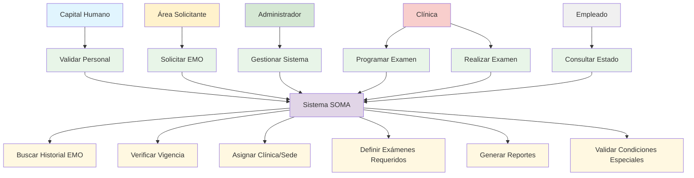

# Diagrama de Casos de Uso - Módulo SOMA

## Descripción
Este diagrama muestra los casos de uso principales del sistema SOMA para la gestión de exámenes médicos ocupacionales (EMO).

## Descripción de Actores

### Capital Humano
- **Responsabilidad**: Validar que el personal esté aprobado para pasar el EMO
- **Acciones**: Verificar datos del empleado, aprobar solicitudes

### Área Solicitante
- **Responsabilidad**: Solicitar EMO para personal nuevo o existente
- **Acciones**: Enviar datos del empleado, justificar necesidad

### Administrador
- **Responsabilidad**: Gestionar configuración del sistema
- **Acciones**: Configurar clínicas, sedes, tipos de exámenes

### Clínica
- **Responsabilidad**: Programar y realizar exámenes médicos
- **Acciones**: Asignar citas, realizar exámenes, reportar resultados

### Empleado
- **Responsabilidad**: Consultar estado de su EMO
- **Acciones**: Verificar fechas, ubicaciones, resultados

## Descripción de Casos de Uso

### UC1: Validar Personal
- **Actor Principal**: Capital Humano
- **Descripción**: Verificar que el empleado esté aprobado para pasar EMO
- **Precondiciones**: Empleado registrado en el sistema
- **Flujo Principal**: 
  1. Recibir datos del empleado
  2. Verificar aprobación
  3. Confirmar elegibilidad

### UC2: Solicitar EMO
- **Actor Principal**: Área Solicitante
- **Descripción**: Solicitar examen médico para empleado
- **Precondiciones**: Personal validado por Capital Humano
- **Flujo Principal**:
  1. Ingresar datos del empleado
  2. Seleccionar tipo de examen requerido
  3. Enviar solicitud

### UC7: Buscar Historial EMO
- **Actor Principal**: Sistema
- **Descripción**: Consultar si el empleado tiene EMO vigente
- **Precondiciones**: Empleado registrado
- **Flujo Principal**:
  1. Buscar en base de datos
  2. Verificar vigencia
  3. Retornar resultado

### UC9: Asignar Clínica/Sede
- **Actor Principal**: Sistema
- **Descripción**: Asignar clínica según ubicación del empleado
- **Precondiciones**: Empleado sin EMO vigente
- **Flujo Principal**:
  1. Determinar ubicación del empleado
  2. Seleccionar clínica más cercana
  3. Asignar sede disponible

### UC10: Definir Exámenes Requeridos
- **Actor Principal**: Sistema
- **Descripción**: Determinar exámenes según edad y género
- **Precondiciones**: Empleado asignado a clínica
- **Flujo Principal**:
  1. Verificar edad del empleado
  2. Verificar género
  3. Aplicar reglas de negocio
  4. Definir exámenes requeridos
