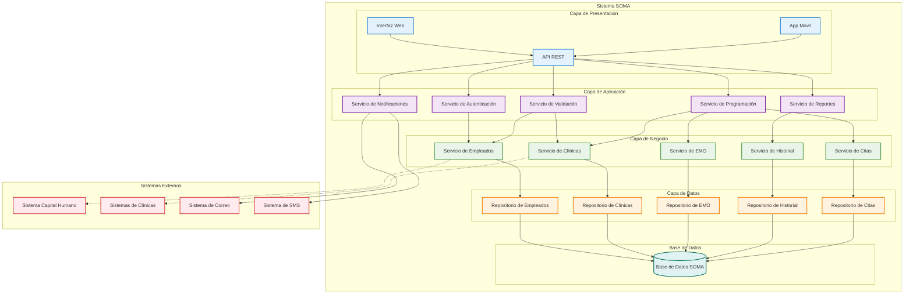

# Diagrama de Componentes - Sistema SOMA

## Descripción
Este diagrama muestra la arquitectura de componentes del sistema SOMA, incluyendo las interfaces, dependencias y relaciones entre los diferentes módulos del sistema.

## Descripción de Componentes

### Capa de Presentación

#### Interfaz Web
- **Propósito**: Interfaz principal para usuarios administrativos
- **Tecnologías**: HTML5, CSS3, JavaScript, Framework Frontend
- **Funcionalidades**: 
  - Gestión de solicitudes EMO
  - Programación de citas
  - Generación de reportes
  - Administración del sistema

#### App Móvil
- **Propósito**: Interfaz para empleados y personal móvil
- **Tecnologías**: React Native, Flutter, o nativa
- **Funcionalidades**:
  - Consulta de estado EMO
  - Notificaciones de citas
  - Información de clínicas

#### API REST
- **Propósito**: Punto de entrada para todas las operaciones
- **Tecnologías**: Node.js, Express, o Spring Boot
- **Funcionalidades**:
  - Endpoints para todas las operaciones
  - Autenticación y autorización
  - Validación de datos de entrada

### Capa de Aplicación

#### Servicio de Autenticación
- **Responsabilidad**: Gestión de usuarios y permisos
- **Funcionalidades**:
  - Login/logout
  - Gestión de sesiones
  - Control de acceso por roles

#### Servicio de Validación
- **Responsabilidad**: Validación de datos y reglas de negocio
- **Funcionalidades**:
  - Validación de datos de empleados
  - Verificación de reglas de negocio
  - Validación de disponibilidad

#### Servicio de Programación
- **Responsabilidad**: Gestión de citas médicas
- **Funcionalidades**:
  - Programación de citas
  - Asignación de clínicas
  - Gestión de disponibilidad

#### Servicio de Notificaciones
- **Responsabilidad**: Envío de notificaciones
- **Funcionalidades**:
  - Notificaciones por email
  - Notificaciones por SMS
  - Notificaciones push

#### Servicio de Reportes
- **Responsabilidad**: Generación de reportes
- **Funcionalidades**:
  - Reportes de solicitudes
  - Estadísticas de EMO
  - Reportes de clínicas

### Capa de Negocio

#### Servicio de Empleados
- **Responsabilidad**: Gestión de información de empleados
- **Funcionalidades**:
  - CRUD de empleados
  - Validación de datos
  - Cálculo de edad y género

#### Servicio de Clínicas
- **Responsabilidad**: Gestión de clínicas y sedes
- **Funcionalidades**:
  - Gestión de clínicas
  - Gestión de sedes
  - Verificación de disponibilidad

#### Servicio de EMO
- **Responsabilidad**: Gestión de exámenes médicos
- **Funcionalidades**:
  - Creación de solicitudes
  - Determinación de exámenes
  - Gestión del flujo

#### Servicio de Historial
- **Responsabilidad**: Gestión del historial médico
- **Funcionalidades**:
  - Consulta de historial
  - Verificación de vigencia
  - Actualización de resultados

#### Servicio de Citas
- **Responsabilidad**: Gestión de citas médicas
- **Funcionalidades**:
  - Programación de citas
  - Confirmación de citas
  - Reprogramación

### Capa de Datos

#### Repositorios
- **Propósito**: Abstracción de acceso a datos
- **Funcionalidades**:
  - Operaciones CRUD
  - Consultas complejas
  - Transacciones

### Base de Datos
- **Tecnología**: PostgreSQL, MySQL, o SQL Server
- **Funcionalidades**:
  - Almacenamiento de datos
  - Integridad referencial
  - Backup y recuperación

## Sistemas Externos

### Sistema Capital Humano
- **Propósito**: Validación de empleados
- **Interfaz**: API REST o Web Service
- **Funcionalidades**: Verificación de aprobación de personal

### Sistemas de Clínicas
- **Propósito**: Integración con sistemas de clínicas
- **Interfaz**: API REST
- **Funcionalidades**: 
  - Consulta de disponibilidad
  - Programación de citas
  - Reporte de resultados

### Sistema de Correo
- **Propósito**: Envío de notificaciones por email
- **Interfaz**: SMTP
- **Funcionalidades**: Notificaciones automáticas

### Sistema de SMS
- **Propósito**: Envío de notificaciones por SMS
- **Interfaz**: API REST
- **Funcionalidades**: Notificaciones urgentes

## Interfaces y Dependencias

### Dependencias Internas
- **Presentación → Aplicación**: Todas las operaciones pasan por la capa de aplicación
- **Aplicación → Negocio**: Los servicios de aplicación utilizan los servicios de negocio
- **Negocio → Datos**: Los servicios de negocio acceden a datos a través de repositorios
- **Datos → Base de Datos**: Los repositorios interactúan directamente con la BD

### Dependencias Externas
- **Servicio de Empleados → Sistema Capital Humano**: Para validación de empleados
- **Servicio de Clínicas → Sistemas de Clínicas**: Para integración con clínicas
- **Servicio de Notificaciones → Sistemas de Correo/SMS**: Para envío de notificaciones

## Patrones de Arquitectura

### Patrón MVC (Model-View-Controller)
- **Model**: Capa de Negocio y Datos
- **View**: Capa de Presentación
- **Controller**: Capa de Aplicación

### Patrón Repository
- **Implementación**: Repositorios en la capa de datos
- **Beneficio**: Abstracción del acceso a datos

### Patrón Service Layer
- **Implementación**: Servicios en las capas de aplicación y negocio
- **Beneficio**: Separación de responsabilidades

## Consideraciones de Seguridad

### Autenticación
- **Método**: JWT (JSON Web Tokens)
- **Implementación**: Servicio de Autenticación

### Autorización
- **Método**: Control de acceso basado en roles (RBAC)
- **Roles**: Administrador, Capital Humano, Área Solicitante, Empleado

### Validación de Datos
- **Implementación**: Servicio de Validación
- **Funcionalidades**: Sanitización y validación de entrada

## Escalabilidad

### Horizontal
- **Load Balancer**: Para distribución de carga
- **Microservicios**: Servicios independientes escalables

### Vertical
- **Optimización de consultas**: Índices y optimización de BD
- **Caching**: Redis para datos frecuentemente accedidos
