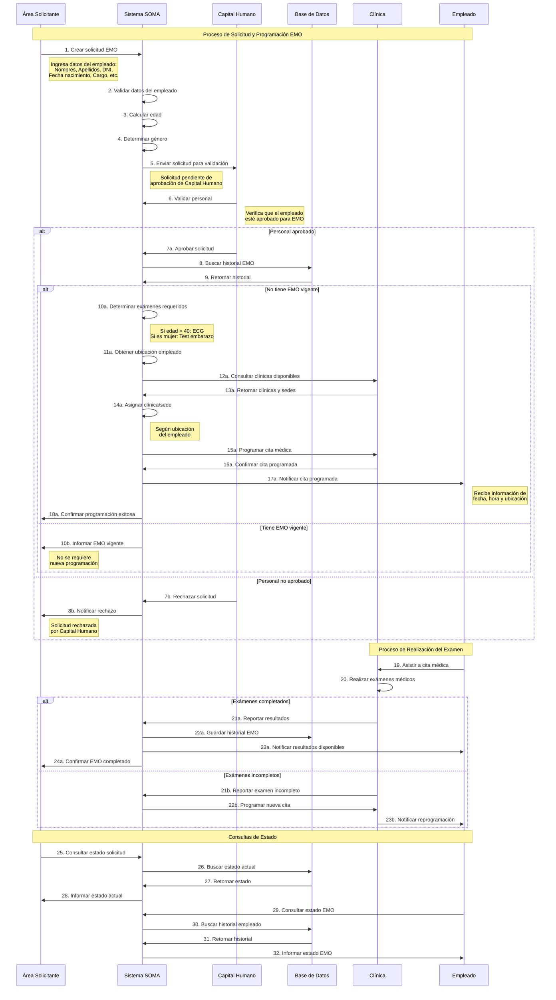

# Diagrama de Secuencia - Flujo EMO

## Descripción
Este diagrama muestra la secuencia de interacciones entre los actores y el sistema SOMA durante el proceso completo de solicitud y programación de un EMO.

## Descripción del Flujo

### Fase 1: Solicitud Inicial
1. **Área Solicitante** crea la solicitud ingresando todos los datos del empleado
2. **Sistema SOMA** valida los datos y calcula edad/género automáticamente
3. Se envía la solicitud a **Capital Humano** para validación

### Fase 2: Validación
4. **Capital Humano** revisa y valida que el empleado esté aprobado
5. Si es aprobado, el sistema busca el historial EMO en la base de datos
6. Si no tiene EMO vigente, se procede con la programación

### Fase 3: Programación
7. El sistema determina los exámenes requeridos según reglas de negocio:
   - Si edad > 40 años: incluir electrocardiograma
   - Si es mujer: incluir test de embarazo
8. Se obtiene la ubicación del empleado
9. Se consultan las clínicas disponibles
10. Se asigna la clínica/sede más cercana
11. Se programa la cita médica
12. Se notifica al empleado y área solicitante

### Fase 4: Realización del Examen
13. El empleado asiste a la cita programada
14. La clínica realiza los exámenes médicos
15. Se reportan los resultados al sistema
16. Se actualiza el historial EMO

### Fase 5: Consultas
17. Tanto el área solicitante como el empleado pueden consultar el estado en cualquier momento

## Puntos de Decisión Clave

- **Validación de Capital Humano**: Determina si el proceso continúa
- **Historial EMO**: Si existe uno vigente, no se requiere nueva programación
- **Exámenes Requeridos**: Se determinan automáticamente según edad y género
- **Asignación de Clínica**: Se basa en la ubicación del empleado
- **Resultados del Examen**: Pueden requerir reprogramación si están incompletos

## Manejo de Errores

- **Solicitud Rechazada**: Se notifica inmediatamente al área solicitante
- **EMO Vigente**: Se informa que no se requiere nueva programación
- **Examen Incompleto**: Se programa automáticamente una nueva cita
- **Clínica No Disponible**: Se busca alternativa o se reprograma
